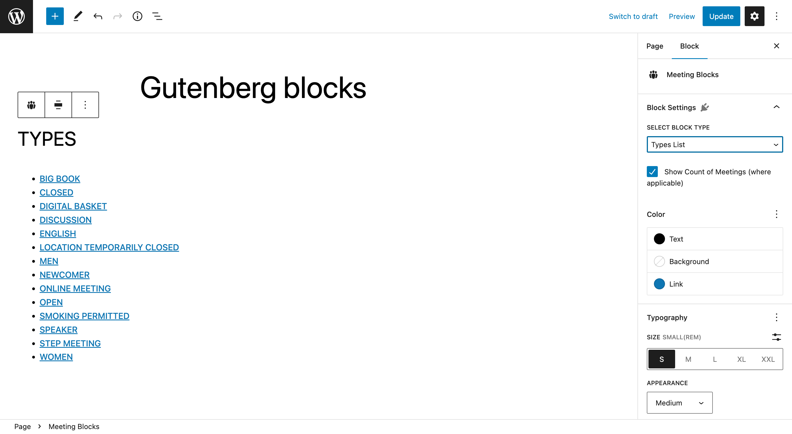
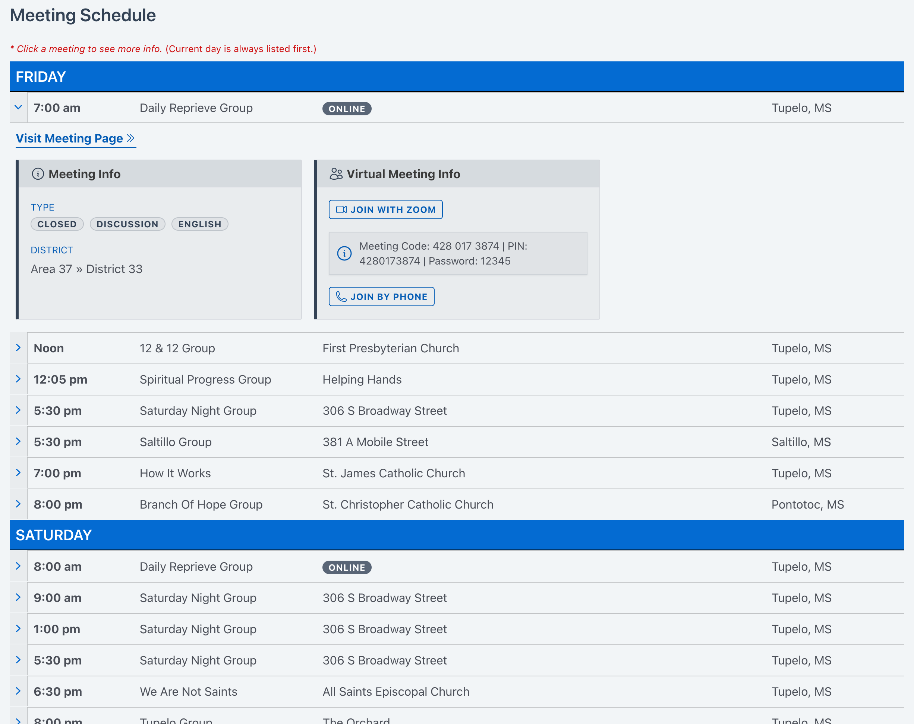
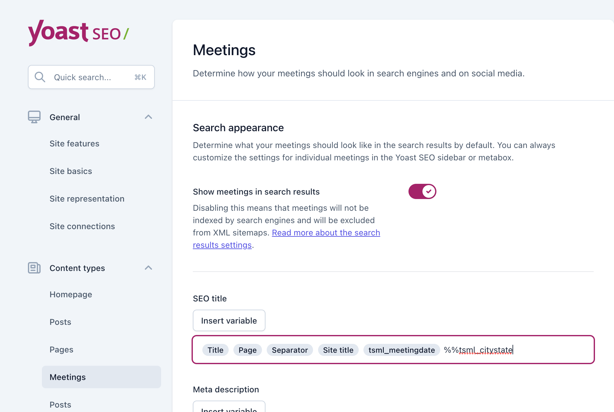

# 12 Step Meeting List Xtras

"12 Step Meeting List Xtras" is a WordPress plugin that provides extra settings, templates, fields, shortcodes, and other features for the "12 Step Meeting List" plugin. It includes a unique ID field for groups, custom blocks for the Gutenberg editor, a condensed meeting table, and other useful features. Additionally, the plugin allows for structured data markup and easy management of meeting types. You can install the plugin from the WordPress Plugin Directory and get support by opening a new [discussion](https://github.com/anchovie91471/12-Step-Meeting-List-Xtras/discussions).

*Hope you enjoy!*  
## Features
1. **Group Unique ID field**: Use the provided field to store a group's GSO/WSO ID or any other unique ID that you find useful.
2. **Block editor (Gutenberg) blocks**: Add blocks anywhere with the new WordPress Gutenberg editor and control styles with the editor's built-in styling capabilities. Blocks include:
    * **12 Step Meeting List Xtras Meeting Table**: An accordion style table of **all** meetings. This is a very condensed design for smaller service entities like districts or intergroups that don't need all the filters and search provided with TSML. _**Keep in mind, this loads all meetings so if your site has thousands of meetings, the block can severaly slow down page load**_.
        * Meetings are grouped by the day of the week, with the current day always listed first.
        * Each meeting can be clicked on to see the address, online meeting info & 7th Tradition donation links.
        * Colors are set in the settings for this plugin.
    * **Main Meetings UI**: This is the meeting list from the 12 Step Meeting List plugin that you typically see on your https://mywebsite.com/meetings page.
        * This block relies heavily on custom JavaScript or react.js, (depending on whether you choose TSML UI or Legacy UI in your TSML settings) so there is no preview & styling is not possible because the TSML UI comes with it's own styles, but you can add it and it will appear on your page on the front-end.
    * **Next (Upcoming) Meetings**: Show a table of next (X) meetings and choose colors for text, background & links as well as font size, font weight & font case.
    * **Meeting Types List**: Show a list of links to all meeting types (open, closed, book study, etc) used on your site and choose colors for text, background & links as well as font size, font weight & font case.
    * **Regions List**: Show a list of links to all regions used on your site, with or without a count of meetings in that region) and choose colors for text, background & links as well as font size, font weight & font case.
3. **Shortcodes**: Use the [tsmlx] shortcode to display the 12 Step Meeting List Xtras Meeting Table (described above under Block Editor blocks.
    * Add text above and below the meeting table with a full rich text editor.
4. **Yoast SEO Variables**: Allows you to add useful Yoast replacements tokens to your meeting page SEO Title & Description. *(only works with 12 Step Meeting List Legacy UI)*
   > **%%tsml_meetingdate%%**: Adds the day & time of a meeting (i.e. Sunday 5:30 pm).

   > **%%tsml_city%%**: Adds the meeting location city

   > **%%tsml_state%%**: Adds the meeting location state

   > **%%tsml_citystate%%**: Adds the meeting location city & state (i.e. Nashville, TN)

   > **%%tsml_group%%**: Adds the group name
5. **Disable Meetings Page**: This disables the main /meetings page, in case you are using one of our blocks or a shortcode on another page (like your homepage) and don't want the meetings page indexed by search engines.
6. **Schema.org markup**: This adds structured json data to your meeting pages (and group pages if you use them) to improve SEO. The data is not visible to users. It is only in the source of your page to provide better context to Search Engines. Each meeting uses the [LocalBusiness](https://schema.org/LocalBusiness) type and uses the meeting info (name, location, virtual info, etc.) to fill in the data.
6. **Mange Meeting Types**: We provide an easy, non-code way to manage your meeting types. On the 12 Step Meeting List Xtras settings page, you can change the label of any meeting type, hide types you don't use, & add new types. You can also change the order meeting types appear if you use the [tsmlx] shortcode or block.

## Installation
The best way to install this plugin is via [its home page](https://wordpress.org/plugins/12-step-meeting-list/) in the WordPress Plugin Directory.

## Support
**First, Check out the help tab, located at the top right, on the TSML Xtras settings page for detailed explanations of each part of the plugin.**

Need more help? Found a bug? Have an idea for a new feature? Please [open a new discussion](https://github.com/anchovie91471/12-Step-Meeting-List-Xtras/discussions).

## Screen Shots

### Settings

### Wordpress Block Editor (Gutenberg)

### [tsmlx] Shorcode Preview

#### Accordion Closed

#### Accordion Open

### Yoost Replacement Tokens

